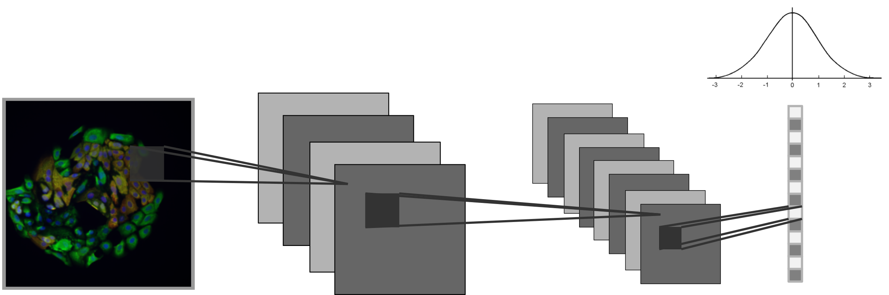

#	ImageVAE

##	Variational autoencoder for cellular image analysis.

Variational autoencoders (VAEs) represent a distinct class of deep learning model designed to learn optimal encodings of an input dataset and reduce dimensionality of input data.
To do so, a VAE trains both encoder and decoder networks concurrently to optimize the decoded reconstruction of an input data point given its learned encoding subject to the capacity constraints of the model.
By specifying the size of the latent feature vector, these networks learn salient features necessary to reconstitute a cellular image post-encoding.

