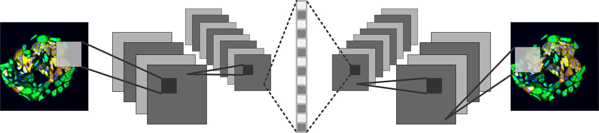

#	ImageVAE

##	Variational autoencoder for cellular image analysis.

Variational autoencoders (VAEs) represent a distinct class of deep learning model designed to learn optimal encodings of an input dataset and reduce dimensionality of input data.
To do so, a VAE trains both encoder and decoder networks concurrently to optimize the decoded reconstruction of an input data point given its learned encoding subject to the capacity constraints of the model.
By specifying the size of the latent feature vector, these networks learn salient features necessary to reconstitute a cellular image post-encoding.



##	Microenvironment Microarray Data

This model was originally developed to analyze images of multicellular growth response to microenvironment perturbation, as shown in the figure.
These data are available for download at original resolution at <https://www.synapse.org/mep_lincs>.

## Training a VAE

To train a VAE model, ensure each file of the dataet is contained in data/train. Then, simply call main.py and point the model to the data/ directory.
Keras will automatically flow data from the data/train directory.

```bash

python main.py \
    --data_dir data/ \
    --save_dir save/ \
    --latent_dim 16 \
    --batch_size 32 \
    --epochs 20 \
    --phase train

```

